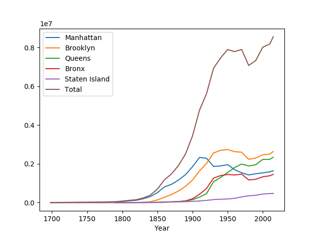
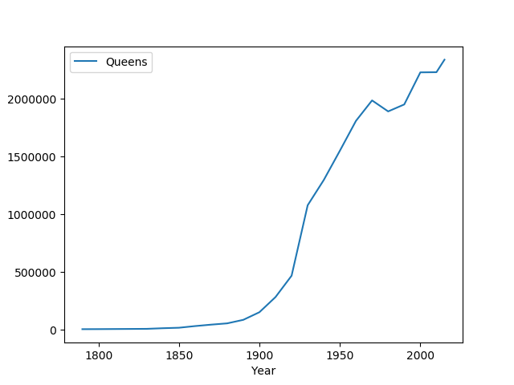
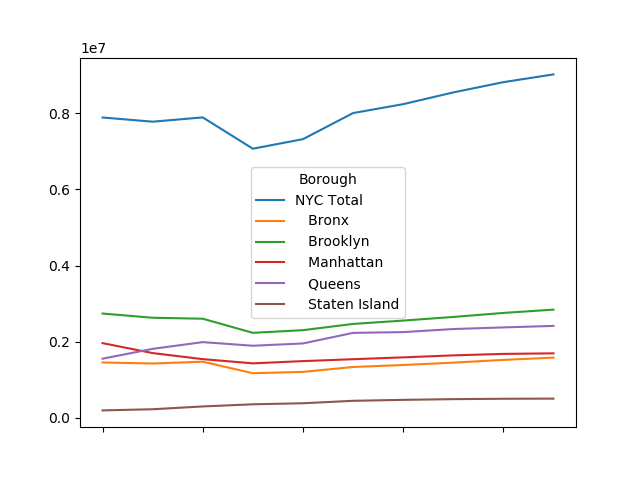
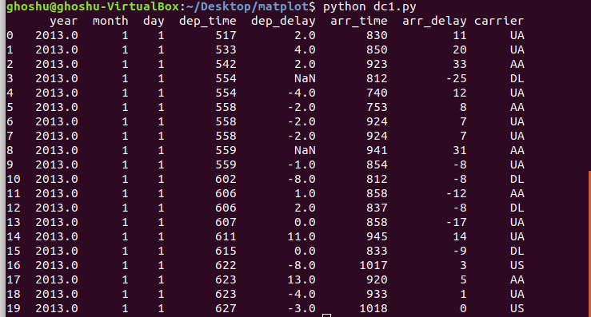
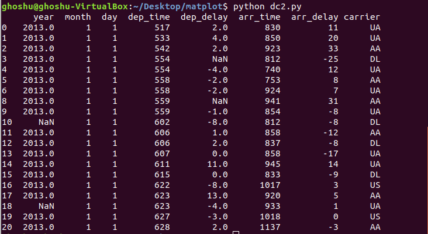
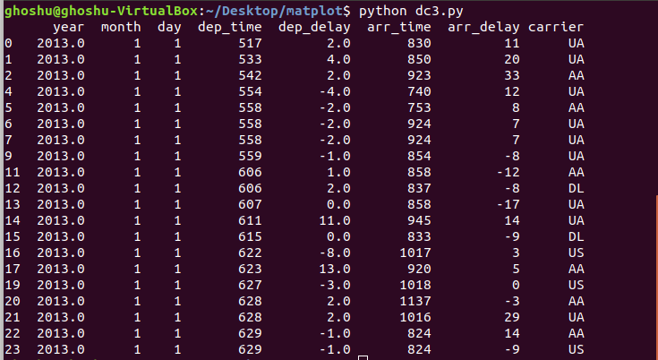

Assignment 4
============

**Due: Oct 3, 2024 07:00 PM US Central Time**. Push to GitHub to submit the assignment.

This assignment has two parts. In Part 1, you are going to read CSV file and plot graphs using Pandas. In Part 2, you are going to clean the bad data in a dataset using Pandas.  

# Part 1 

Please download NYC-pop1.csv and NYC-pop2.csv files and implement the following: 

## 1. Read the NYC-pop1.csv file and show the plot of data as similar to the following:

**Note**: You need to skip first 5 rows while reading NYC-pop1.csv file. Write your code in mtp1.py file.

## 2. Read the NYC-pop1.csv file and plot the data of Queens as similar to the following:

**Note**: You need to skip first 5 rows while reading NYC-pop1.csv file. Write your code in mtp2.py file.

## 3. Read the NYC-pop2.csv file, use 'Borough' as the index_col, and save the dataframe in a variable df. Next you need to transpose df by adding the following line to our program: df1 = df.T. Plot the graph using the dataframe df1. Your output should be similar to the following:

**Note**: Write your code in mtp3.py file.

# Part 2: 

Please download fligts.csv file and implement the following:

## 1. Read the flights.csv file and replace empty cells with the mode value that appears most frequently in Column Year. Your output should be similar to the following:

**Note**: Write your code in dc1.py file.

## 2. Read the flights.csv file and remove the duplicate cells with the. Your output should be similar to the following:

**Note**: Write your code in dc2.py file.

## 3. Read the flights.csv file and remove the rows that contain empty cells. Your output should be similar to the following:

**Note**: Write your code in dc3.py file.

## Tasks
* For Part 1, Q1, write your code in mtp1.py file.
* For Part 1, Q2, write your code in mtp2.py file.
* For Part 1, Q3, write your code in mtp3.py file.
* For Part 2, Q1, write your code in dc1.py file.
* For Part 2, Q2, write your code in dc2.py file.
* For Part 2, Q3, write your code in dc3.py file.

## Evaluation
Your assignment will be graded according to the following criteria:

* mtp1.py carries 20-points for correct implementation.
* mtp2.py carries 10-points for correct implementation.
* mtp3.py carries 20-points for correct implementation.
* dc1.py carries 20-points for correct implementation.
* dc2.py carries 20-points for correct implementation.
* dc3.py carries 10-points for correct implementation.
